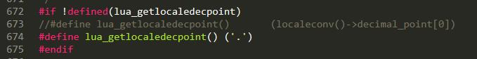

# LuaLib

CMake 命令编译静态库

lua5.3.4、luasocket、lua-protobuf

[lua5.3.4] http://www.lua.org/ftp/lua-5.3.4.tar.gz

[luasocket] https://github.com/diegonehab/luasocket

[lua-protobuf] https://github.com/starwing/lua-protobuf

Android NDK 版本： android-ndk-r10e

备注:
loslib.cpp 修改如下：

luaconf.h 修改如下：

